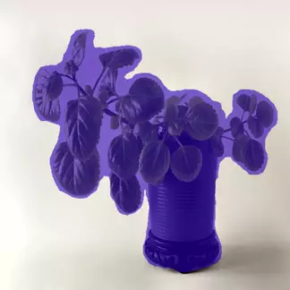
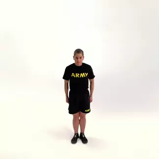
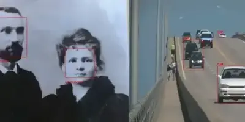

# NXP NNStreamer examples
Purpose of this repository is to provide, for demonstration purpose, functional examples of GStreamer/NNStreamer-based pipelines optimized and validated for some designated NXP i.MX application processors.

# How to run examples
## Models and metadata download
Models and metadata files used by examples are not archived in this repository.
Therefore they have to be downloaded over the network, prior to execution of the examples on the target. Download of those files is to be done from the host PC, running Jupyter Notebook [download.ipynb](./downloads).
Refer to [download instruction](./downloads/README.md) for details.
## Execution on target
### Python
Once models have been fetched locally on host PC, repository will contain both examples and downloaded artifacts. Thus it can be uploaded to the target board for individual examples execution. Complete repository can either be uploaded from host PC to target using regular `scp` command or only the necessary directories using [upload.sh](./tools/upload.sh) script provided for host:
```bash
# replace <target ip address> by relevant value
cd /path/to/nxp-nnstreamer-examples
./tools/upload.sh root@<target ip address>
```
### C++ with cross-compilation
1- Fetch the models locally on host PC. <br>
2- Build a Yocto BSP SDK for the dedicated i.MX platform. Refer to the [imx-manifest](https://github.com/nxp-imx/imx-manifest) to setup the correct building environment, SDK needs to be compiled with bitbake using `imx-image-full` and `populate_sdk` command as followed:<br>
```bash
bitbake imx-image-full -c populate_sdk
```
3- Once successfully generated, the Yocto BSP SDK environment setup script located in `/path/to/yocto/bld-xwayland/tmp/deploy/sdk/` must be executed. <br>
```bash
chmod a+x fsl-imx-<backend>-glibc-x86_64-imx-image-full-armv8-<machine>-toolchain-<release>.sh
./fsl-imx-<backend>-glibc-x86_64-imx-image-full-armv8-<machine>-toolchain-<release>.sh
```
4- Source the SDK environment:<br>
*NOTE: the SDK is installed by default in /opt/fsl-imx-xwayland/<LF_version>/*
```bash
. /path/to/sdk/environment-setup-armv8-poky-linux
```
5- Compile C++ examples with CMake:
```bash
cd /path/to/nxp-nnstreamer-examples
mkdir build && cd $_
cmake ..
make
```
6- Push the required artifacts in its expected folder on the board (the scp command can be used for this purpose): <br>
*NOTE: path to the folder containing the data can be changed in CMakeLists.txt file as well as model and label names in the cpp example source file.*
```bash
# Send classification example to target, replacing <target ip address> by relevant value
scp ./classification/example_classification_mobilenet_v1_tflite root@<target ip address>
```
C++ examples use a set of high-level classes to create optimized pipelines for NXP boards, which use NXP hardware optimizations. A description of how to use this set of classes can be found [here](./common/cpp/README.md).

### Compile models on target for i.MX 93
Quantized TFLite models must be compiled with vela for i.MX 93 Ethos-U NPU.
This must be done directly on the target:
```bash
cd /path/to/nxp-nnstreamer-examples
./downloads/compile_models.sh
```
Examples can then be run directly on the target. More information on individual examples execution is available in relevant sections.

# Tasks
Note that examples may not run on all platforms - check table below for platform compatibility.

Snapshot | Name | Platforms | Implementations | Models | ML engine | Features
-------- | ---- | --------- | ----- | ---------- | -------- | ---------------
[](./tasks/object-detection/) | [Object Detection](./tasks/object-detection/) | i.MX 8M Plus<br>i.MX 93<br>i.MX 95 | Bash<br>C++ | MobileNet SSD<br>YOLOv4 Tiny | TFLite | v4l2 camera<br>gst-launch<br>[custom python tensor_filter](./tasks/object-detection/postprocess_yolov4_tiny.py)
[](./tasks/classification/) | [Classification](./tasks/classification/) | i.MX 8M Plus<br>i.MX 93<br>i.MX 95 | Bash<br>C++ | MobileNet | TFLite | v4l2 camera<br>video file decoding<br>gst-launch
[](./tasks/semantic-segmentation/) | [Semantic Segmentation](./tasks/semantic-segmentation/) | i.MX 8M Plus<br>i.MX 93<br>i.MX 95 | Bash<br>C++ | DeepLabV3 | TFLite | jpeg files slideshow<br>gst-launch
[](./tasks/pose-estimation/) | [Pose Estimation](./tasks/pose-estimation/) |i.MX 8M Plus<br>i.MX 93<br>i.MX 95 | C++<br>Python | MoveNet | TFLite | v4l2 camera<br>video file decoding<br>gst-launch<br>custom model decoding
[](./tasks/face-processing/) | [Face Processing](./tasks/face-processing/) | i.MX 8M Plus<br>i.MX 93<br>i.MX 95 | C++<br>Python | UltraFace-slim <br> FaceNet512 <br> Deepface-emotion | TFLite | v4l2 camera<br>video file decoding<br>gst-launch<br>custom model decoding
[](./tasks/monocular-depth-estimation/) | [Monocular Depth Estimation](./tasks/monocular-depth-estimation/) | i.MX 8M Plus<br>i.MX 93<br>i.MX 95 | C++ | MiDaS v2 | TFLite | v4l2 camera<br>video file decoding<br>gst-launch<br>custom model decoding
[](./tasks/mixed-demos/) | [Mixed Demos](./tasks/mixed-demos/) | i.MX 8M Plus<br>i.MX 93<br>i.MX 95 | C++ | MobileNet SSD<br>MobileNet<br>MoveNet<br>UltraFace-slim<br>Deepface-emotion | TFLite | v4l2 camera<br>video file decoding<br>gst-launch<br>custom model decoding<br>video file encoding

*Images and video used have been released under Creative Commons CC0 1.0 license or belong to Public Domain*