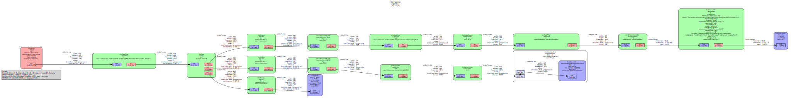
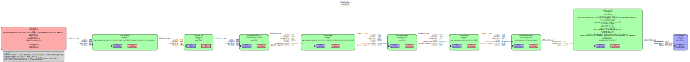

# Faces demos

## Overview
Name | Implementation | Model | ML engine | Features
--- | --- | --- | --- | ---
[example_face_detection_tflite.py](./example_face_detection_tflite.py) | Python | UltraFace | TFLite | camera<br>gst-launch<br>
[example_face_detection_tflite.cpp](./cpp/example_face_detection_tflite.cpp) | C++ | UltraFace | TFLite | camera<br>gst-launch<br>
[example_face_recognition_tflite.py](./example_face_recognition_tflite.py) | Python | UltraFace <br> FaceNet512 <br> | TFLite | camera<br>gst-launch<br>
[example_emotion_detection_tflite.py](./example_emotion_detection_tflite.py) | Python | UltraFace <br> Deepface-emotion <br> | TFLite | camera<br>gst-launch<br>
[example_emotion_detection_tflite.cpp](./cpp/example_emotion_detection_tflite.cpp) | C++ | UltraFace <br> Deepface-emotion <br> | TFLite | camera<br>gst-launch<br>

Those examples use 2 GStreamer pipelines that are running concurrently.<br>
Press ```Esc or ctrl+C``` to stop the execution of all the pipelines.<br>
Display can be flipped using the --mirror option.<br>

### Main pipeline
- Captures video from camera
- Run face detection (UltraFace) model and decode results
- Overlays detection on top of video before display
- Schedules second pipeline execution



### Secondary pipeline
- Uses input from main pipeline: video frame and face detection results
- Is scheduled once per face detected
- Crops video for a face in video stream
- Run second ML model inference (e.g. face recognition) on cropped video and decodes results



## Face detection
### Python
|   Platforms  | NPU | CPU | GPU |
| ------------ | --- | --- | --- |
| i.MX 8M Plus | :white_check_mark: | :x: | :x: |
|   i.MX 93    | :white_check_mark: | :x: | :x: |
|   i.MX 95    | :x: | :white_check_mark: | :x: |

Demo application is to be started from Linux. Camera device node may be configured via command line argument (default: `/dev/video3` on i.MX 8M Plus and `/dev/video0` on i.MX 93, `/dev/video13` on i.MX 95).
It draws bounding boxes around the detected faces, and displays number of detections.
```
./face/example_face_detection_tflite.py [--camera_device=</dev/videoN>]
```
### C++
|   Platforms  | NPU | CPU | GPU |
| ------------ | --- | --- | --- |
| i.MX 8M Plus | :white_check_mark: | :white_check_mark: | :white_check_mark: |
|   i.MX 93    | :white_check_mark: | :white_check_mark: | :x: |
|   i.MX 95    | :x: | :white_check_mark: | :white_check_mark: |

C++ example script needs to be generated with [cross compilation](../). [setup_environment.sh](../tools/setup_environment.sh) script needs to be executed in [nxp-nnstreamer-examples](../) folder to define data paths:
```bash
. ./tools/setup_environment.sh
```
It is possible to run the face detection demo inference on NPU with the following script:
```bash
./build/face/example_face_detection_tflite -p ${ULTRAFACE_QUANT}
```
For i.MX 93 use vela converted model:
```bash
./build/face/example_face_detection_tflite -p ${ULTRAFACE_QUANT_VELA}
```
The following execution parameters are available (Run ``` ./example_face_detection_tflite -h``` to see option details):

Option | Description
--- | ---
-b, --backend | Use the selected backend (CPU, GPU, NPU)<br> default: NPU
-n, --normalization | Use the selected normalization (none, centered, reduced, centeredReduced, castInt32, castuInt8)<br> default: none
-c, --camera_device | Use the selected camera device (/dev/video{number})<br>default: /dev/video0 for i.MX 93 and /dev/video3 for i.MX 8MP
-p, --model_path | Use the selected model path
-d, --display_perf |Display performances, can specify time or freq
-t, --text_color | Color of performances displayed, can choose between red, green, blue, and black<br> default: white
-g, --graph_path | Path to store the result of the OpenVX graph compilation (only for i.MX8MPlus)<br> default: home directory

Press ```Esc or ctrl+C``` to stop the execution of the pipeline.

## Emotion detection
### Python
|   Platforms  | NPU | CPU | GPU |
| ------------ | --- | --- | --- |
| i.MX 8M Plus | :white_check_mark: | :x: | :x: |
|   i.MX 93    | :white_check_mark: | :x: | :x: |
|   i.MX 95    | :x: | :white_check_mark: | :x: |

Demo application is to be started from Linux. Camera device node may be configured via command line argument (default: `/dev/video3` on i.MX 8M Plus, `/dev/video0` on i.MX 93, `/dev/video13` on i.MX 95).
It draws bounding boxes around the detected faces, and displays predicted emotion and confidence score on each face.
```
./face/example_emotion_detection_tflite.py [--camera_device=</dev/videoN>]
```
7 emotions can be recognised: angry, disgust, fear, happy, sad, surprise and neutral.

### C++
|   Platforms  | NPU | CPU | GPU |
| ------------ | --- | --- | --- |
| i.MX 8M Plus | :white_check_mark: | :white_check_mark: | :white_check_mark: |
|   i.MX 93    | :white_check_mark: | :white_check_mark: | :x: |
|   i.MX 95    | :x: | :white_check_mark: | :white_check_mark: |

C++ example script needs to be generated with [cross compilation](../). [setup_environment.sh](../tools/setup_environment.sh) script needs to be executed in [nxp-nnstreamer-examples](../) folder to define data paths:
```bash
. ./tools/setup_environment.sh
```
 It is possible to run the emotion detection demo inference on NPU with the following script:<br>
```bash
./build/face/example_emotion_detection_tflite -p ${ULTRAFACE_QUANT},${EMOTION_QUANT}
```
For i.MX 93 use vela converted model:
```bash
./build/face/example_emotion_detection_tflite -p ${ULTRAFACE_QUANT_VELA},${EMOTION_QUANT_VELA}
```

The following execution parameters are available (Run ``` ./example_emotion_detection_tflite -h``` to see option details):

Option | Description
--- | ---
-b, --backend | Use the selected backend (CPU, GPU, NPU)<br> default: NPU
-n, --normalization | Use the selected normalization (none, centered, reduced, centeredReduced, castInt32, castuInt8)<br> default: none
-c, --camera_device | Use the selected camera device (/dev/video{number})<br>default: /dev/video0 for i.MX 93 and /dev/video3 for i.MX 8MP
-p, --model_path FACE_MODEL,EMOTION_MODEL | Use the selected model path
-d, --display_perf |Display performances, can specify time or freq
-t, --text_color | Color of performances displayed, can choose between red, green, blue, and black<br> default: white
-g, --graph_path | Path to store the result of the OpenVX graph compilation (only for i.MX8MPlus)<br> default: home directory

Press ```Esc or ctrl+C``` to stop the execution of the pipeline.

## Face recognition
### Python
|   Platforms  | NPU | CPU | GPU |
| ------------ | --- | --- | --- |
| i.MX 8M Plus | :white_check_mark: | :x: | :x: |
|   i.MX 93    | :white_check_mark: | :x: | :x: |
|   i.MX 95    | :x: | :white_check_mark: | :x: |

Demo application is to be started from Linux. Camera device node may be configured via command line argument (default: `/dev/video3` on i.MX 8M Plus, `/dev/video0` on i.MX 93, `/dev/video13` on i.MX 95).
It draws bounding boxes around the detected faces, and displays associated name and confidence score if face matches an embedding from the database. 
```
./face/example_face_recognition_tflite.py [--camera_device=</dev/videoN>]
```
Database of recognizable face signatures (embeddings) is located in [face/facenet_db](./facenet_db) directory. An entry in there simply associates the \<name\> from file `<name>.npy`, with its embedding for the face, saved as a numpy binary array.
```
~/myrepo/nnst/nxp-nnstreamer-examples/face/facenet_db$ ls -al
total 20
drwxrwxr-x 2 nxa24178 nxa24178 4096 déc.  15 15:29 .
drwxrwxr-x 4 nxa24178 nxa24178 4096 déc.  15 15:27 ..
-rw-rw-r-- 1 nxa24178 nxa24178 2176 déc.  15 15:26 angelina_jolie.npy
-rw-rw-r-- 1 nxa24178 nxa24178 2176 déc.  14 09:50 brad_pitt.npy
-rw-rw-r-- 1 nxa24178 nxa24178 2176 déc.  14 09:50 thispersondoesnotexist.npy
```
New entries can simply be created in two different ways:
1. From within example application when running on target board: press \<ENTER\> in Linux console and enter name for the face detected on camera. 
2. Create an entry from a still image, typically in host PC, inferencing the image and storing the resulting embedding. Provided script [face/facenet_create_embedding.py](./facenet_create_embedding.py) can be used for this purpose.

## `facenet_create_embedding.py` script usage on host PC
1. Save image to file system
2. Use an image editor e.g. [gimp](https://www.gimp.org/) to identify pixel coordinates (x0, y0, width, height) of the face to be cropped
  * NOTE 1: cropped region should include only part of forehead and chin
  * NOTE 2: cropped region has to be a square so requires having weight equal to width
3. Create python virtual environment to install required packages and execute the script

Virtual env creation and packages install:
```
$ python -m venv myenv
$ source ./myenv/bin/activate
(myenv)$ pip install -r facenet_create_embedding_requirements.txt
```

Execute script from the activated virtual env, specifying path to the image and crop info to be used.
For instance using sample image [thispersondoesnotexist.jpeg](./thispersondoesnotexist.jpeg):

```
(myenv)$ cd //path/to/nxp-nnstreamer-examples/face
(myenv)$ ./facenet_create_embedding.py --img_path=./thispersondoesnotexist.jpeg --x0=227 --y0=317 --width_height=610

[...]
# Compute embedding for ./thispersondoesnotexist.jpeg 
# Cropped area (x0, y0)=(227, 317) width/height=610
[...]
# Embedding file saved to ./thispersondoesnotexist.npy
```

Resulting embedding numpy file (`.npy`) can be copied to the [database](./facenet_db) of faces that will be recognized.

Note: image [thispersondoesnotexist.jpeg](./thispersondoesnotexist.jpeg) has been generated by an AI on website [www.thispersondoesnotexist.com](https://www.thispersondoesnotexist.com/).
